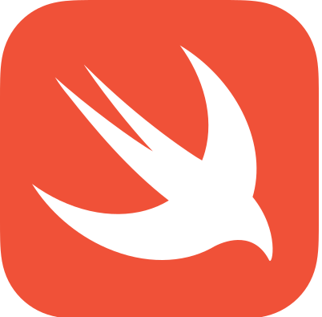
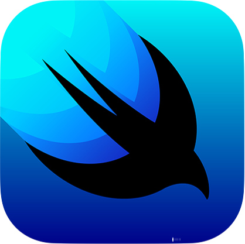

## Portfolio

I am a iOS developer with an experience of over 3.5 years. I have hands on experience working with swift language and UIKit, SwiftUI frameworks. I have extensively worked on iOS development for 3 years.

---

## Skills

  
  &nbsp;
  

---

## Experience

### **SENIOR SOFTWARE DEVELOPER**
### ACCENTURE SOLUTIONS PVT, LTD

Working on Swift, Apple native mobile application development language using UIKit and SwiftUI frameworks. Created chat functionality, note taking page. Working on desigining and developeing mobile apps for fortune 500 companies.
Migrated Objective-C code to Swift.

---

## Education

### **SAVITRIBAI PHULE PUNE UNIVERSITY**
### BE (2014- 2018)

---

### INTERESTS
Apart from being a iOS developer, I do content creation on Instagram and Youtube. 

I enjoy being outdoors, so I go for run everyday. I love travelling to different places and explore different cultures. When I am inside ,I play box cricket with my brother :) in my free time.
